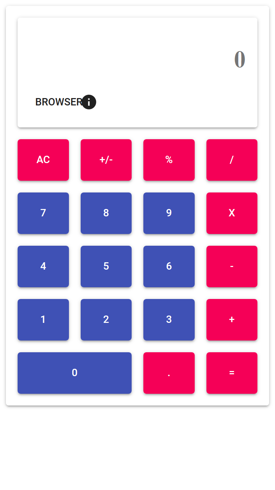

# Calculator in React.js

This calculator was created in react and uses different backends to perform calculations.
A particular backend to note, is a [trained ml model](https://github.com/asaladino/calc-ml) created with keras and tensorflow.

You can view a deployed version at http://calc.codingsimply.com/

